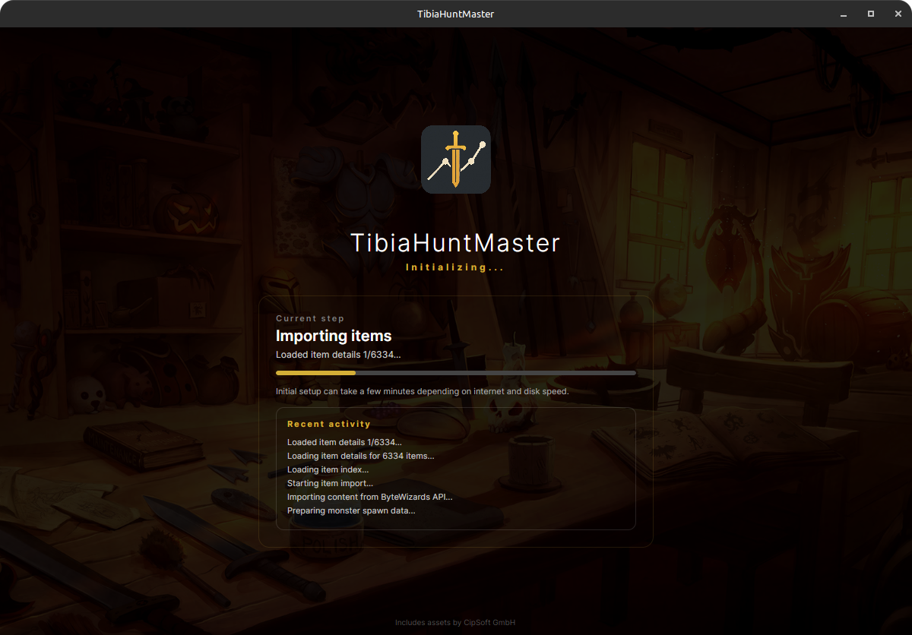
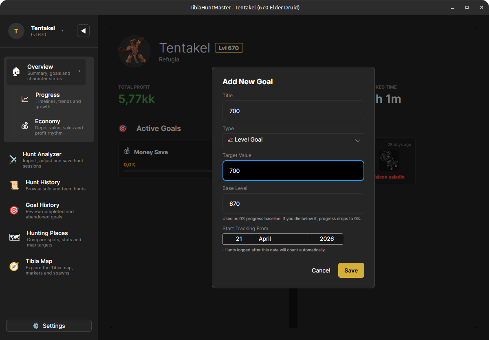
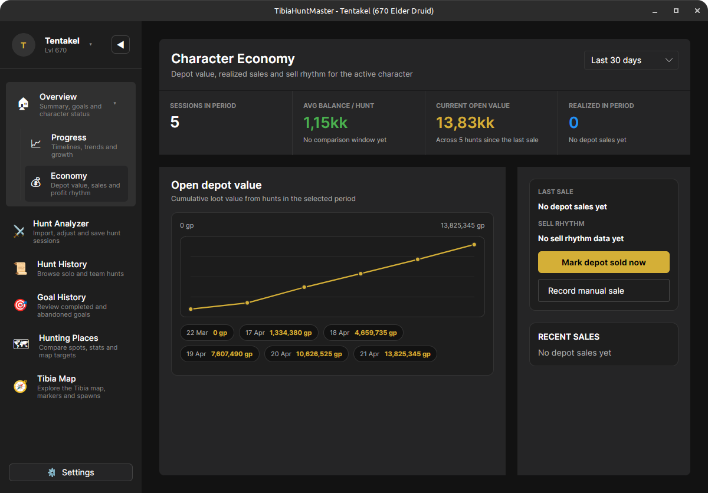
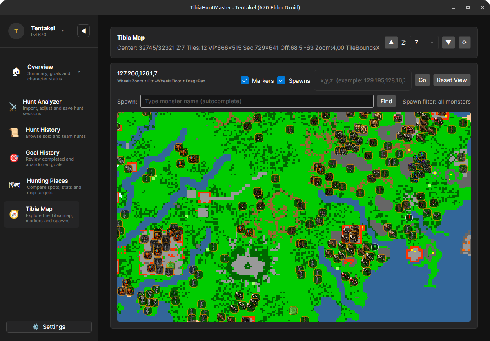
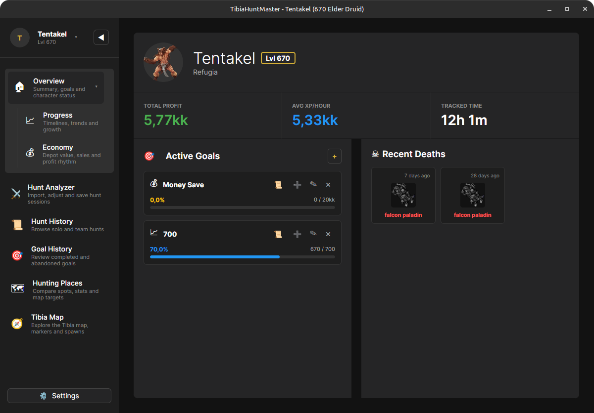
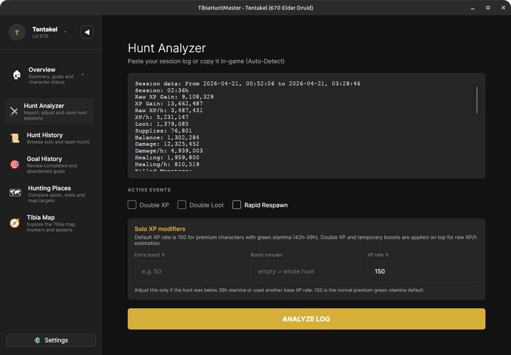
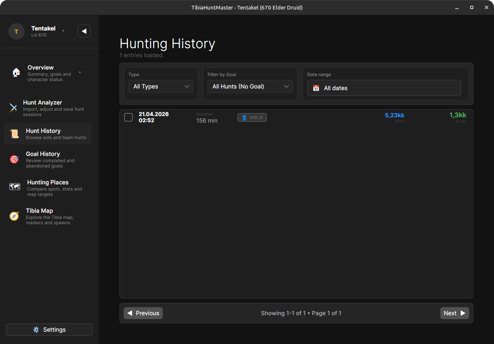
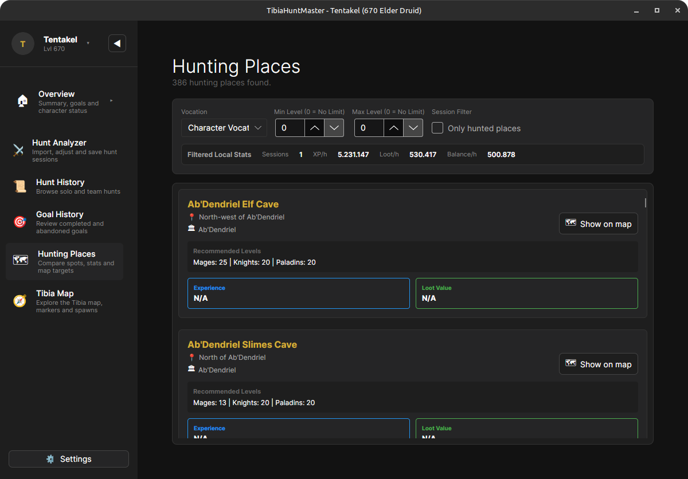
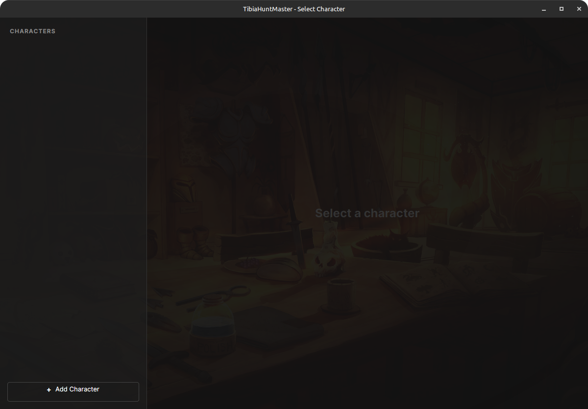
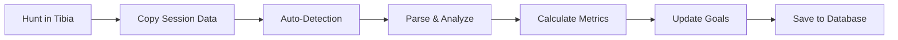

<div align="center">

# TibiaHuntMaster 🐉

**Track your progress. Optimize your hunts. Reach your goals.**



A powerful desktop companion for Tibia players that automatically captures, analyzes, and tracks your hunting sessions—helping you level smarter, not harder.

[](https://dotnet.microsoft.com/)
[](https://github.com/yourusername/TibiaHuntMaster)
[](LICENSE)

[Features](#-features) • [Screenshots](#-screenshots) • [Getting Started](#-getting-started) • [How It Works](#-how-it-works) • [Privacy](#-privacy--data)

</div>

---

## 🎯 Why TibiaHuntMaster?

Stop manually tracking your hunts in spreadsheets. TibiaHuntMaster automatically imports your Tibia session data via clipboard, analyzes every detail, and helps you optimize your gameplay with actionable insights.

### ✨ Features

#### 📋 **Effortless Session Tracking**
- **One-click import** – Copy session data from Tibia, paste automatically detected
- **Detailed analytics** – XP/h, profit, damage, healing, creature kills, loot breakdown
- **Solo & team hunts** – Full support for party sessions with individual contributions
- **100% local storage** – SQLite database, your data never leaves your machine

#### 🎯 **Goal System**
- Set level or gold milestones
- Track progress automatically after each hunt
- Visual progress bars and ETA calculations
- Multiple concurrent goals supported



#### 📊 **Advanced Analytics**
- **Hunt History** – Filter by date, location, goal, or hunt type
- **Economy Tracking** – Monitor depot value, sales, and profit rhythm
- **Performance Comparison** – Identify your most profitable spawns and times



#### 🗺️ **Interactive Tibia Map**
- Browse all hunting spawns with creature markers
- Search for specific monsters or locations
- Visualize spawn density and recommended levels
- Integrated with ByteWizards content data and TibiaPal recommendations



#### 🧪 **Smart Hunt Recommendations**
- Vocation-based spawn suggestions
- Level-appropriate filtering
- Detailed creature information and loot tables

#### ⚔️ **Imbuement Calculator**
- Manage imbuement profiles
- Track material costs and availability
- Plan your budget before committing

---

## 📸 Screenshots

### Dashboard Overview
Your command center with active goals, recent statistics, and death tracking.



### Hunt Analyzer
Import and analyze sessions with automatic clipboard detection. Handles XP modifiers, active events, and validation warnings.



### Hunt History
Review all past sessions with advanced filtering by type, goal, or date range.



### Hunting Places
Explore 386+ hunting locations with vocation-specific recommendations and stats.



---

## 🚀 Getting Started

### Requirements
- **Operating System:** Windows, Linux, or macOS
- **.NET 10 Runtime** ([download here](https://dotnet.microsoft.com/download/dotnet/10.0))
- **Internet connection** (optional, for creature/item data sync during first run)

### Installation

1. Download the latest release for your platform
2. Extract and run `TibiaHuntMaster`
3. The app will automatically initialize the database and download game data



### First Hunt

1. **Add your character** – Use TibiaData lookup or manual entry
2. **Hunt in Tibia** – Play normally and generate session data
3. **Copy session log** – Select all text in your session window (Ctrl+A) and copy (Ctrl+C)
4. **Auto-import** – TibiaHuntMaster detects the clipboard and parses your hunt
5. **Save & analyze** – Review the results and save to history

---

## 🧠 How It Works



1. **Clipboard Monitoring** – Detects Tibia session data format automatically
2. **Intelligent Parsing** – Extracts XP, loot, damage, healing, creatures, and items
3. **XP Calculation** – Handles premium bonuses, events (Double XP, Rapid Respawn), and boost modifiers
4. **Validation** – Warns about potential data inconsistencies or missing information
5. **Goal Tracking** – Automatically updates progress for all active goals
6. **Historical Storage** – Stores sessions with full metadata for future analysis

---

## 💡 Use Cases

### For Power Levelers
Track XP/h across different spawns and times to identify optimal hunting conditions.

### For Profit Hunters
Monitor loot vs. supplies to find consistent gold-making routes. Use the Economy view to track depot value over time.

### For Achievement Hunters
Set level or gold goals and watch your progress update automatically.

### For Team Players
Import team hunts and review damage dealt, supplies used, and loot distribution per player.

---

## 🗃️ Privacy & Data

All data is stored **100% locally** in a SQLite database:

- **Windows:** `C:\Users\<YourName>\AppData\Local\TibiaHuntMaster\tibiahuntmaster.db`
- **Linux/macOS:** `~/.local/share/TibiaHuntMaster/tibiahuntmaster.db`

**No telemetry. No cloud sync. No tracking.** Your hunt data stays on your machine.

The app optionally downloads public game data (creatures, items, spawns) during initialization. Content data is provided through the ByteWizards API, which is based on TibiaWiki data, and character lookup uses TibiaData. This is read-only and contains no personal information.

---

## 🔧 Troubleshooting

<details>
<summary><strong>Clipboard not detected?</strong></summary>

- Ensure TibiaHuntMaster window is open and visible while copying
- Check that you're copying from the Tibia session data window (not chat)
- On Linux, clipboard access may require X11 or Wayland permissions
</details>

<details>
<summary><strong>Slow or failing imports?</strong></summary>

- Check your internet connection—initial setup downloads 6000+ items and creatures
- Subsequent imports work offline using cached data
</details>

<details>
<summary><strong>Missing goals or features?</strong></summary>

- Save at least one hunt first—Overview and History populate after the first session
- Goals must be manually created in the Dashboard
</details>

<details>
<summary><strong>Database errors or corruption?</strong></summary>

- Open **Settings** (⚙️ icon in the bottom left corner)
- Use **Update Database** to refresh content without losing your hunt data
- Use **Rebuild Database** to clear and re-import the local content tables from the API
- Both options are safe and will not delete your hunt history, characters, or other user data
</details>

---

## 🛠️ Development

### Building from Source

```bash
# Clone the repository
git clone https://github.com/yourusername/TibiaHuntMaster.git
cd TibiaHuntMaster

# Restore dependencies
dotnet restore

# Build
dotnet build

# Run
dotnet run --project TibiaHuntMaster.App
```

### Testing

```bash
# Run all tests
dotnet test

# Run specific test suite
dotnet test --filter "FullyQualifiedName~LocalizationIntegrationTests"
```

### Architecture

- **Frontend:** Avalonia UI (cross-platform XAML)
- **Backend:** .NET 10, Entity Framework Core
- **Database:** SQLite with automatic migrations
- **Content Sync:** ByteWizards API for creatures, items, and hunting places
- **Localization:** 6 languages (EN, DE, ES, PL, PT, SV)

---

## 📜 License

This project is licensed under the MIT License - see the [LICENSE](LICENSE) file for details.

---

## 🙏 Credits

- **Tibia** is a registered trademark of CipSoft GmbH
- Content data delivered via the [ByteWizards API](https://tibiadata.bytewizards.de/), based on TibiaWiki data
- Hunting spot recommendations sourced from [TibiaPal](https://www.tibiapal.com/)
- Character lookup via [TibiaData API](https://tibiadata.com/)

---

<div align="center">

**Made with ❤️ for the Tibia community**

[Report Bug](https://github.com/yourusername/TibiaHuntMaster/issues) • [Request Feature](https://github.com/yourusername/TibiaHuntMaster/issues)

</div>
