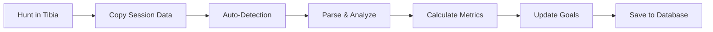

<div align="center">

# TibiaHuntMaster 🐉

**Your hunts. Your data. Your machine.**

A free, native desktop tracker for Tibia hunters — everything you need in one place, without the cloud.


[](https://dotnet.microsoft.com/)
[](https://github.com/MartinRanft/TibiaHuntMaster/actions/workflows/verify.yml)
[](https://github.com/MartinRanft/TibiaHuntMaster/releases)
[](LICENSE)

[Download](#-download) • [Why TibiaHuntMaster](#-why-tibiahuntmaster) • [Features](#-features) • [Screenshots](#-screenshots) • [Roadmap](#-roadmap)

</div>

---

## ⬇️ Download

Pick your platform — no account, no signup, ready in under a minute.

| Platform | Download |
|---|---|
| 🪟 **Windows 10/11** | [**TibiaHuntMaster-Setup.exe**](https://github.com/MartinRanft/TibiaHuntMaster/releases/latest/download/TibiaHuntMaster-Setup.exe) |
| 🐧 **Linux** (AppImage, x64) | [**TibiaHuntMaster-linux-x64.AppImage**](https://github.com/MartinRanft/TibiaHuntMaster/releases/latest/download/TibiaHuntMaster-linux-x64.AppImage) |
| 🍎 **macOS** (Apple Silicon) | [**TibiaHuntMaster-osx-arm64.dmg**](https://github.com/MartinRanft/TibiaHuntMaster/releases/latest/download/TibiaHuntMaster-osx-arm64.dmg) |
| 🍎 **macOS** (Intel) | [**TibiaHuntMaster-osx-x64.dmg**](https://github.com/MartinRanft/TibiaHuntMaster/releases/latest/download/TibiaHuntMaster-osx-x64.dmg) |

> Looking for older versions or release notes? [See all releases on GitHub →](https://github.com/MartinRanft/TibiaHuntMaster/releases)

---

## 🎯 Why TibiaHuntMaster?

Already using a Tibia tracker? Here's what makes us different:

### 🔒 Your data, your machine
No login. No cloud. No telemetry. Your sessions live in a local SQLite database — you own the file, you back it up, you control who sees it. The app even works offline after the one-time content sync.

### 🪟 Native desktop, not a browser tab
TibiaHuntMaster is a real Windows/Linux/macOS app. No tab management, no logout timeouts, no waiting for a webpage to load every time. Open it next to Tibia, paste your session, get back to playing.

### 🧰 Five tools in one place
Stop juggling browser tabs. Hunt analysis, goal tracking, hunting place explorer, imbuement calculator, and economy tracking — all in a single window with one consistent interface.

### 📈 Goals that learn from your history
Most tools either track sessions OR estimate level times. We do both. Set a level goal, and your projected ETA updates automatically based on the rolling average of your real hunts. The more you play, the smarter the predictions.

### 🆓 Free and open source
MIT-licensed. No premium tier, no paywall, no ads. Inspect the source, fork it, contribute. [Source on GitHub →](https://github.com/MartinRanft/TibiaHuntMaster)

---

## ✨ Features

#### 📋 Effortless Session Tracking
- **One-click import** — copy session data from Tibia, auto-detected from the clipboard
- **Detailed analytics** — XP/h, profit, damage, healing, creature kills, loot breakdown
- **Solo & team hunts** — full support for party sessions with individual contributions
- **100% local storage** — SQLite database, your data never leaves your machine

#### 🎯 Goal System
- Set level or gold milestones
- Track progress automatically after each hunt
- Visual progress bars and ETA calculations based on YOUR history
- Multiple concurrent goals supported


#### 📊 Advanced Analytics
- **Hunt History** — filter by date, location, goal, or hunt type
- **Economy Tracking** — monitor depot value, sales, and profit rhythm
- **Performance Comparison** — identify your most profitable spawns and times


#### 🗺️ Interactive Tibia Map
- Browse 386+ hunting spawns with creature markers
- Search for specific monsters or locations
- Visualize spawn density and recommended levels
- Integrated with ByteWizards content data and TibiaPal recommendations


#### 🧪 Smart Hunt Recommendations
- Vocation-based spawn suggestions
- Level-appropriate filtering
- Detailed creature information and loot tables

#### ⚔️ Imbuement Calculator
- Manage imbuement profiles
- Track material costs and availability
- Plan your budget before committing

---

## 📸 Screenshots

### Dashboard Overview
Your command center with active goals, recent statistics, and death tracking.


### Hunt Analyzer
Import and analyze sessions with automatic clipboard detection. Handles XP modifiers, active events, and validation warnings.


### Hunt History
Review all past sessions with advanced filtering by type, goal, or date range.


### Hunting Places
Explore 386+ hunting locations with vocation-specific recommendations and stats.


---

## 🗺️ Roadmap

We're building features that *no other Tibia tracker currently covers*. Up next:

- **Personal hunt benchmarking** — "Your last 5 sessions at Cobra Bastion are 12% below your 30-day average. Try Asura Palace?"
- **Weekly insights dashboard** — auto-generated summary: best spawn, total profit, time played, level progress
- **Bestiary-aware hunt suggestions** — "You need 47 more Cyclops for charm progress — here's where they spawn"

> Have an idea? [Open an issue](https://github.com/MartinRanft/TibiaHuntMaster/issues/new) — feature requests are welcome.

---

## 🚀 Getting Started

### Requirements
- **Operating System:** Windows, Linux, or macOS
- **.NET 10 Runtime** ([download here](https://dotnet.microsoft.com/download/dotnet/10.0)) — bundled with installer on Windows
- **Internet connection** — only for the first run (content data sync)

> **Note:** macOS builds are provided but currently untested. Windows and Linux are fully tested via CI/CD. If you encounter issues on macOS, please [report them](https://github.com/MartinRanft/TibiaHuntMaster/issues).

### First Hunt

1. **Add your character** — use TibiaData lookup or manual entry
2. **Hunt in Tibia** — play normally and generate session data
3. **Copy session log** — select all text in the session window (Ctrl+A) and copy (Ctrl+C)
4. **Auto-import** — TibiaHuntMaster detects the clipboard and parses your hunt
5. **Save & analyze** — review the results and save to history


---

## 🧠 How It Works



1. **Clipboard Monitoring** — detects Tibia session data format automatically
2. **Intelligent Parsing** — extracts XP, loot, damage, healing, creatures, and items
3. **XP Calculation** — handles premium bonuses, events (Double XP, Rapid Respawn), and boost modifiers
4. **Validation** — warns about potential data inconsistencies or missing information
5. **Goal Tracking** — automatically updates progress for all active goals
6. **Historical Storage** — stores sessions with full metadata for future analysis

---

## 🗃️ Privacy & Data

All data is stored **100% locally** in a SQLite database:

- **Windows:** `C:\Users\<YourName>\AppData\Local\TibiaHuntMaster\tibiahuntmaster.db`
- **Linux/macOS:** `~/.local/share/TibiaHuntMaster/tibiahuntmaster.db`

**No telemetry. No cloud sync. No tracking.** Your hunt data stays on your machine.

The app optionally downloads public game data (creatures, items, spawns) during initialization. Content data is provided through the ByteWizards API, which is based on TibiaWiki data, and character lookup uses TibiaData. This is read-only and contains no personal information.

---

## 🔧 Troubleshooting

<details>
<summary><strong>Clipboard not detected?</strong></summary>

- Ensure TibiaHuntMaster window is open and visible while copying
- Check that you're copying from the Tibia session data window (not chat)
- On Linux, clipboard access may require X11 or Wayland permissions
</details>

<details>
<summary><strong>Slow or failing imports?</strong></summary>

- Check your internet connection — initial setup downloads 6000+ items and creatures
- Subsequent imports work offline using cached data
</details>

<details>
<summary><strong>Missing goals or features?</strong></summary>

- Save at least one hunt first — Overview and History populate after the first session
- Goals must be manually created in the Dashboard
</details>

<details>
<summary><strong>Database errors or corruption?</strong></summary>

- Open **Settings** (⚙️ icon in the bottom left corner)
- Use **Update Database** to refresh content without losing your hunt data
- Use **Rebuild Database** to clear and re-import the local content tables from the API
- Both options are safe and will not delete your hunt history, characters, or other user data
</details>

---

## 🛠️ Development

### Building from Source

```bash
# Clone the repository
git clone https://github.com/MartinRanft/TibiaHuntMaster.git
cd TibiaHuntMaster

# Restore dependencies
dotnet restore

# Build
dotnet build

# Run
dotnet run --project TibiaHuntMaster.App
```

### Testing

```bash
# Run all tests
dotnet test

# Run specific test suite
dotnet test --filter "FullyQualifiedName~LocalizationIntegrationTests"
```

### Architecture

- **Frontend:** Avalonia UI (cross-platform XAML)
- **Backend:** .NET 10, Entity Framework Core
- **Database:** SQLite with automatic migrations
- **Content Sync:** ByteWizards API for creatures, items, and hunting places
- **Localization:** 6 languages (EN, DE, ES, PL, PT, SV)

---

## 📜 License

**Software:** This project's source code is licensed under the [MIT License](LICENSE).

**Tibia Assets:** All Tibia-related graphical assets (monster images, item sprites, map tiles, icons) remain the intellectual property of **CipSoft GmbH** and are used in accordance with their Fansite and Streaming policies. These assets are **not** covered by the MIT License.

See the [LICENSE](LICENSE) file for full details.

---

## 🙏 Credits

- **Tibia** is a registered trademark of CipSoft GmbH
- Tibia game assets (sprites, images, icons) © CipSoft GmbH — used with permission under Fansite policy
- Content data delivered via the [ByteWizards API](https://tibiadata.bytewizards.de/), based on TibiaWiki data
- Hunting spot recommendations sourced from [TibiaPal](https://www.tibiapal.com/)
- Character lookup via [TibiaData API](https://tibiadata.com/)

---

<div align="center">

**Made with ❤️ for the Tibia community**

[Report Bug](https://github.com/MartinRanft/TibiaHuntMaster/issues) • [Request Feature](https://github.com/MartinRanft/TibiaHuntMaster/issues)

</div>
